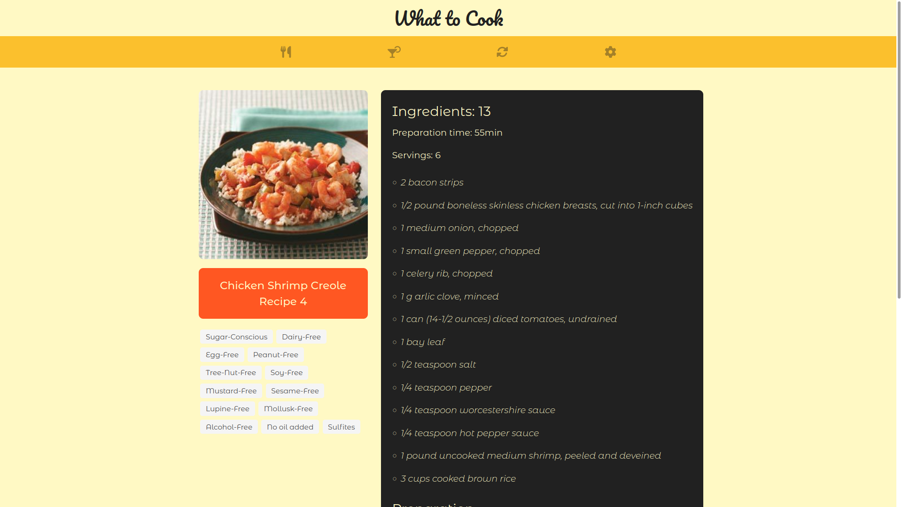
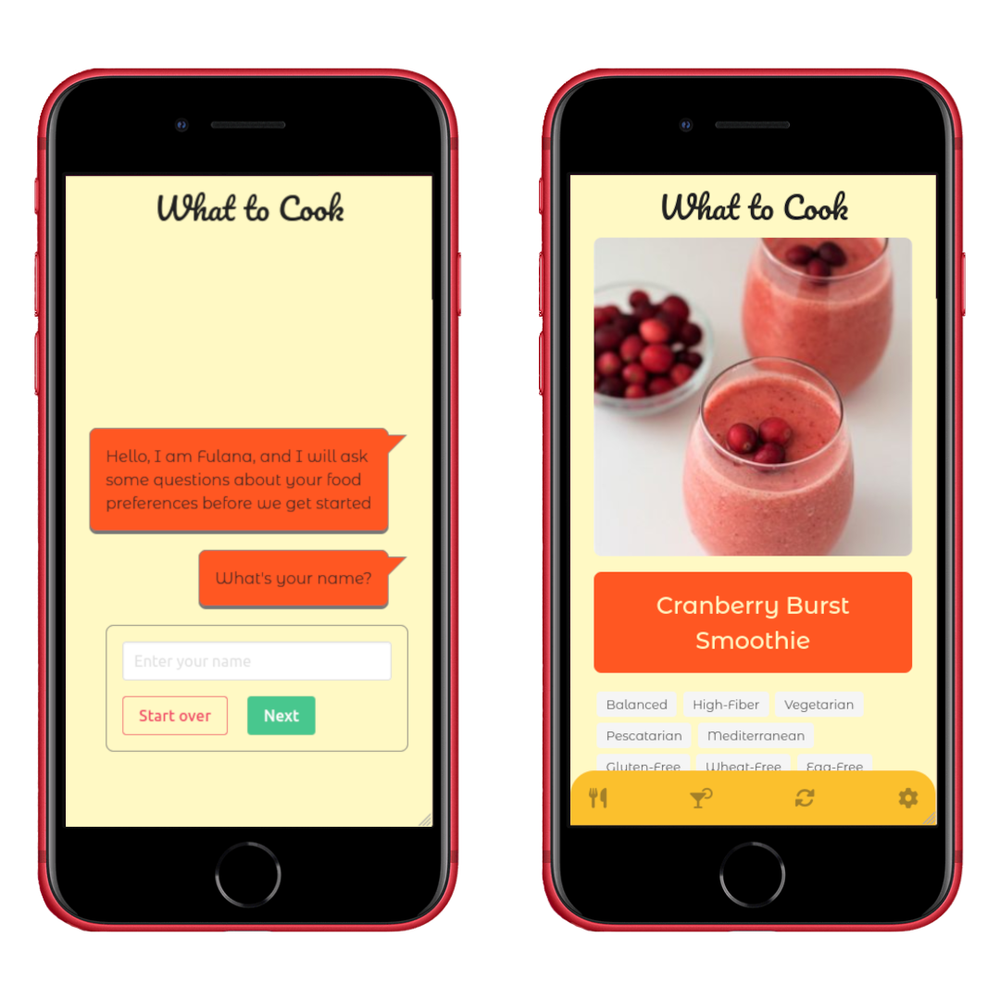

# :fork_and_knife: What to Cook :cocktail:

## :page_with_curl: About

HTML, CSS, and JavaScript project 
I developed a random recipe suggestions web app fetching for recipes data from the Edman's API. We also implemented a chat-bot to set user preferences.

## :man_technologist: Developed Skills

* Create a brand new project from scratch using all the content we learned during the module
* Use a public API to fetch data
* Create and test the asynchronous functions using TDD
* Manipulate HTML elements with the DOM API
* React to user interations by using event listeners
* Implement a responsive design with CSS flexbox and media queries
* The project was non-evaluative

## :memo: Methodologies

* Mobile First
* Test Driven Development (TDD)
* Pair programming

## :hammer_and_wrench: Tools

* HTML5
* CSS3
* JavaScript ES6+
* Jest
* Bulma
* Font Awesome (icon library)

## :iphone: Mobile version

